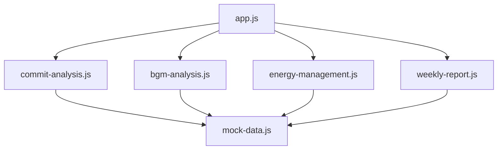

<p align="center">
  
  
  
  
</p>

<h1 align="center">⌨️ DevHabit Dashboard</h1>

<p align="center">
  <b>エンジニアのコーディング習慣を可視化し、継続的な成長を支援するダッシュボード</b>
</p>

<p align="center">
  <a href="#features">Features</a> •
  <a href="#demo">Demo</a> •
  <a href="#tech-stack">Tech Stack</a> •
  <a href="#getting-started">Getting Started</a> •
  <a href="#architecture">Architecture</a> •
  <a href="#api-integration">API Integration</a>
</p>

---

## ✨ Features

### 📝 コミットパターン分析
- **ヒートマップ** — 時間帯 × 曜日のコーディング活動をCanvas描画で可視化
- **ストリーク** — 連続コミット日数をSVGリングゲージでアニメーション表示
- **平日/週末比率** — ドーナツチャートでワークスタイルを把握

### 🎵 作業BGM分析
- **ジャンル別リスニング** — どの音楽ジャンルを多く聴いているか一目で確認
- **生産性相関** — ジャンル × コミット数のバブルチャートで「集中できる音楽」を発見
- **再生履歴** — 最近聴いた曲をリスト表示

### 😤 エネルギー管理
- **燃え尽き予測** — 深夜作業比率・週末稼働率など複数要因からリスクスコアを算出
- **エネルギートレンド** — 過去14日間のエネルギーレベルとコミット数を時系列表示
- **活動タイムライン** — 1日の作業ログをスタガーアニメーション付きで表示

### 🏆 週次レポート自動生成
- **Markdownフォーマット** — 今週の活動サマリーを自動生成
- **プレビュー/Markdown切替** — 整形済みプレビューと生Markdownを切替
- **エクスポート** — クリップボードコピー・`.md`ファイルダウンロード対応

---

## 🖥️ Demo

デモモードを搭載しているため、APIトークン不要で即座に全機能を体験できます。

```
index.html をブラウザで開くだけ！
```

---

## 🛠️ Tech Stack

| カテゴリ | 技術 |
|---|---|
| マークアップ | HTML5 (セマンティック) |
| スタイリング | Vanilla CSS (CSS変数、グラスモーフィズム、レスポンシブ) |
| ロジック | Vanilla JavaScript (ES6+ モジュールパターン) |
| チャート | [Chart.js](https://www.chartjs.org/) v4 (CDN) |
| アイコン | [Lucide Icons](https://lucide.dev/) (CDN) |
| フォント | [Inter](https://fonts.google.com/specimen/Inter) + [JetBrains Mono](https://fonts.google.com/specimen/JetBrains+Mono) |
| データ保存 | LocalStorage |

> **フレームワーク不使用** — ピュアなHTML/CSS/JSで構築し、ビルドツールなしで動作します。

---

## 🚀 Getting Started

### 1. クローン

```bash
git clone https://github.com/your-username/devhabit-dashboard.git
cd devhabit-dashboard
```

### 2. 起動

ローカルサーバーで起動するか、`index.html` を直接ブラウザで開きます。

```bash
# Python
python -m http.server 8080

# Node.js
npx serve .
```

### 3. アクセス

```
http://localhost:8080
```

デモモードがデフォルトで有効になっており、モックデータで全チャートが表示されます。

---

## 🏗️ Architecture

```
devhabit-dashboard/
├── index.html              # メインHTML
├── styles.css              # デザインシステム
├── README.md
└── js/
    ├── app.js              # アプリ統括・設定管理
    ├── mock-data.js        # デモ用モックデータ
    ├── commit-analysis.js  # コミットパターン分析
    ├── bgm-analysis.js     # BGM分析チャート
    ├── energy-management.js # エネルギー管理
    └── weekly-report.js    # 週次レポート生成
```

### モジュール構成



---

## 🔌 API Integration

### GitHub API

⚙️ 設定画面からPersonal Access Tokenを登録すると、実際のコミットデータを取得できます。

| 項目 | 値 |
|---|---|
| エンドポイント | `https://api.github.com/users/{username}/events` |
| 認証 | Personal Access Token (PAT) |
| 取得データ | PushEvent, PullRequestEvent |

### Spotify API

⚙️ Spotify for DevelopersでAccess Tokenを取得し、設定画面から登録します。

| 項目 | 値 |
|---|---|
| エンドポイント | `https://api.spotify.com/v1/me/player/recently-played` |
| 認証 | OAuth 2.0 Bearer Token |
| 取得データ | 再生履歴、トラック情報、アーティスト情報 |

> **注意**: APIトークンを登録しなくても、デモモードで全機能を利用できます。

---

## 🎨 Design

- **テーマ**: ダークモード（ネイビー #0a0e1a 〜 パープルアクセント #7c3aed）
- **カード**: グラスモーフィズム（backdrop-filter: blur + 半透明背景）
- **アニメーション**: カウントアップ、チャートフェードイン、ホバーグロウ
- **レスポンシブ**: モバイル〜デスクトップまで対応

---

## 📄 License

MIT License

---

<p align="center">
  Built with 💜 for developers
</p>
